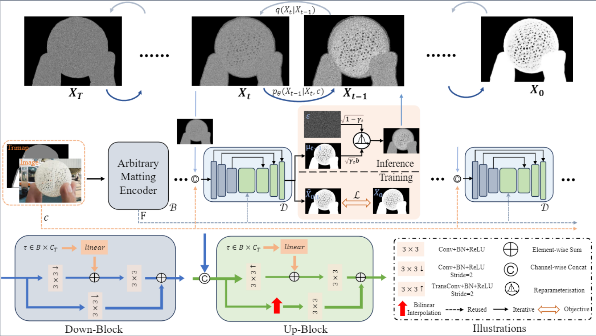
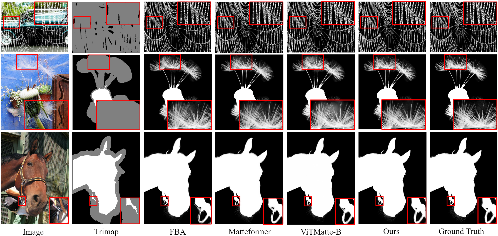
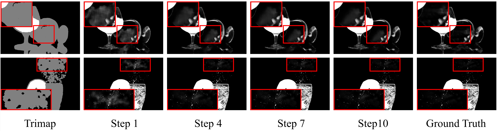

<div align="center">
<!-- <h2>Click2Trimap</h2> -->
<h3>Diffusion for Natural Image Matting </h3>

Yihan Hu, Yiheng Lin, Wei Wang, Yao Zhao, Yunchao Wei, Humphrey Shi

Institute of Information Science, Beijing Jiaotong University
Georgia Tech & Picsart AI Research (PAIR)

<p align="center">
    <a href="https://opensource.org/licenses/MIT">
        
    </a>
    <a href="https://arxiv.org/pdf/2312.05915.pdf">
        
    </a>   
    <a href="[https://arxiv.org/pdf/2312.05915.pdf](https://paperswithcode.com/sota/image-matting-on-composition-1k-1?p=diffusion-for-natural-image-matting)">
        
    </a>  
</p>
</div>


## Introduction
<div align="center"><h4>Introducing diffusion process for iterative matting refinement</h4></div>



We aim to leverage diffusion to address the challenging image matting task. However, the presence of high computational overhead and the inconsistency of noise sampling between the training and inference processes pose significant obstacles to achieving this goal. In this paper, we present DiffMatte, a solution designed to effectively overcome these challenges. First, DiffMatte decouples the decoder from the intricately coupled matting network design, involving only one lightweight decoder in the iterations of the diffusion process. With such a strategy, DiffMatte mitigates the growth of computational overhead as the number of samples increases. Second, we employ a self-aligned training strategy with uniform time intervals, ensuring a consistent noise sampling between training and inference across the entire time domain. Our DiffMatte is designed with flexibility in mind and can seamlessly integrate into various modern matting architectures. Extensive experimental results demonstrate that DiffMatte not only reaches the state-of-the-art level on the Composition-1k test set, surpassing the best methods in the past by 5\% and 15\% in the SAD metric and MSE metric respectively, but also show stronger generalization ability in other benchmarks. 


## Quick Installation 
Our approach is developed in : Python3.88, PyTorch 2.0, CUDA 11.7, CuDNN 8.5.

Run the following command to install required packages. 
<!-- You can refer to the issues of [ViTMatte](https://github.com/hustvl/ViTMatte) if you run into problems.  -->
```
pip install -r requirements.txt
```
Install [detectron2](https://github.com/facebookresearch/detectron2) please following its [document](https://detectron2.readthedocs.io/en/latest/), you can also run following command
```
python -m pip install 'git+https://github.com/facebookresearch/detectron2.git'
```

## Visualization

__Qualitative results__ compared with previous SOTA methods on __Composition-1k__.

__Visualizing the Inference Trajectory__: Depicting the predicted alpha matte at different iterations while employing DDIM with 10 sampling steps.

## Results

Quantitative Results on [Composition-1k](https://paperswithcode.com/dataset/composition-1k) (step 10)
| Model      | SAD   | MSE | Grad | Conn  | Params | checkpoints |
| ---------- | ----- | --- | ---- | ----- | ------ | ----------- |
| DiffMatte-Res34 | 29.20 | 6.04 | 11.37 | 25.48 | 23.9M | [GoogleDrive](https://drive.google.com/file/d/13D8tWjzkWKKSKwvHs-I_zToeGmU8gBJc/view?usp=drive_link) |
| DiffMatte-SwinT | 20.87 | 3.23 | 6.37 | 15.84 | 48.8M | [GoogleDrive](https://drive.google.com/file/d/1TimvLgX3Kf6_N73DUkP0Z99OAE30ry-B/view?usp=drive_link) |
| DiffMatte-ViTS | 20.52 | 3.06 | 7.05 | 14.85 | 29.0M | [GoogleDrive](https://drive.google.com/file/d/11m6y4LI_Hp5u5AagUY_bxPJWkbtsydFV/view?usp=drive_link) |
| DiffMatte-ViTB | 18.63 | 2.54 | 5.82 | 13.10 | 101.4M | [GoogleDrive](https://drive.google.com/file/d/1-Qrtg7txDt53NIreq3PTvgJke6UhuB2z/view?usp=drive_link) |
| DiffMatte-ViTS(1024) | 17.15 | 2.26 | 5.13 | 11.42 | 29.0M | [GoogleDrive](https://drive.google.com/file/d/1NIn-tKtW3zhi2vK3OgOTiiHrOIXuHIZo/view?usp=drive_link) |

---

### Data Preparation
1) Get DIM dataset on [Deep Image Matting](https://sites.google.com/view/deepimagematting).

2) For DIM dataset preparation, please refer to [GCA-Matting](https://github.com/Yaoyi-Li/GCA-Matting).
   - For Training, merge 'Adobe-licensed images' and 'Other' folder to use all 431 foregrounds and alphas
   - For Testing, use 'Composition_code.py' and 'copy_testing_alpha.sh' in GCA-Matting.

3) For background images, Download dataset on [PASCAL](http://host.robots.ox.ac.uk/pascal/VOC/) and [COCO](https://cocodataset.org/#home).

***If you want to download prepared test set directly : [download link](https://drive.google.com/file/d/1fS-uh2Fi0APygd0NPjqfT7jCwUu_a_Xu/view?usp=sharing)** 

### Testing on Composition-1k dataset

1] Run inference code (the predicted alpha will be save to **./predDIM/pred_alpha** by default)

```
python inference.py \
    --config-dir ./configs/CONFIG.py \
    --checkpoint-dir ./CHECKPOINT_PATH \
    --inference-dir ./SAVE_DIR \
    --data-dir /DataDir \
    --sample-strategy "ddim10"
```

2] Evaluate the results by the official evaluation MATLAB code. (provided by [Deep Image Matting](https://sites.google.com/view/deepimagematting))

3] You can also check out the evaluation result simplicity with the python code (un-official) 
```
CUDA_VISIBLE_DEVICES=3 python evaluation.py \
    --pred-dir ./SAVE_DIR \
    --label-dir /DataDir/Composition-1k-testset/alpha_copy \
    --trimap-dir /DataDir/Composition-1k-testset/trimaps
```

## To do list
- [X] Run-one-image Demo
- [ ] training scripts
- [ ] DiffMatte V2

## License
The code is released under the MIT License. It is a short, permissive software license. Basically, you can do whatever you want as long as you include the original copyright and license notice in any copy of the software/source. 

## Citation
```bibtex
@misc{hu2023diffusion,
      title={Diffusion for Natural Image Matting}, 
      author={Yihan Hu and Yiheng Lin and Wei Wang and Yao Zhao and Yunchao Wei and Humphrey Shi},
      year={2023},
      eprint={2312.05915},
      archivePrefix={arXiv},
      primaryClass={cs.CV}
}
```

## Acknowledgement
Our project is developed based on [ViTMatte](https://github.com/hustvl/ViTMatte), [Matteformer](https://github.com/webtoon/matteformer) and [GCA-Matting](https://github.com/Yaoyi-Li/GCA-Matting). Thanks for their wonderful work!<div align="center">
